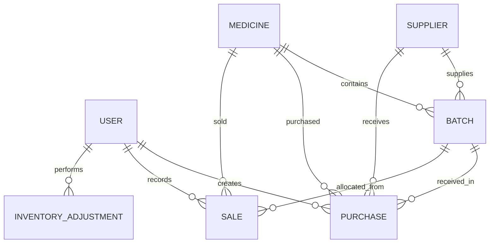

# Database Design

## Database

MongoDB database: `pharma_stock_management`

## Collections

- `users`
- `medicines`
- `suppliers`
- `batches`
- `purchases`
- `sales`
- `notifications`
- `auditlogs`
- `inventoryadjustments`

## Relationships

`purchases` and `sales` reference independent entities by `ObjectId`. Sale allocation subdocuments also reference the exact batches consumed by a FEFO sale.

## Source of truth and derived values

`Batch.quantity` is the stock source of truth. The following values are calculated by services or serializers rather than stored redundantly:

| Value | Calculation |
|---|---|
| Medicine stock | Sum of positive, unexpired batch quantities |
| Batch status | Quantity and expiry date |
| Inventory value | Sum of batch quantity × cost per unit |
| Low-stock alert | Medicine stock below `reorderLevel` |
| Supplier outstanding | Unpaid purchase totals |
| Dashboard/analytics values | MongoDB queries and aggregations over source collections |

## Index strategy

- Unique: `users.email`, `batches.batchNo`, `purchases.purchaseNo`, `sales.saleNo`, `suppliers.name`.
- Batch lookup: `{ medicine: 1, expiryDate: 1, quantity: 1 }` and `{ expiryDate: 1, quantity: 1 }`.
- Transaction filtering: supplier, medicine, date, and status indexes.
- Audit and notification lists: descending `createdAt` indexes.

## Consistency rules

- Batch expiry must be later than manufacture date.
- Quantities are non-negative integers; transaction quantities are positive integers.
- A medicine/supplier cannot be deleted while related batches exist.
- A batch with positive stock cannot be deleted.
- Sale allocations must reference valid batches and sum to the sale quantity.
- Purchase paid amount cannot exceed the purchase total.
- Stock-changing operations run in MongoDB transactions and require a replica set.
