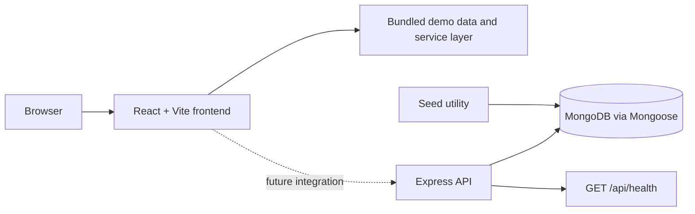

# Database Systems & Backend Development

This repository collects database coursework and a portfolio-oriented application named **PharmaStock**. The repository is organized into two deliberately separate areas:

- `Practicals/` — database systems exercises and reports.
- `Project/` — the PharmaStock medicine inventory interface, backend/domain models, and project documentation.

## PharmaStock

PharmaStock is a pharmaceutical inventory management interface covering medicines, batches, suppliers, purchases, sales, expiry monitoring, low-stock views, analytics, reports, users, and settings.

The current checkout contains two complementary implementations:

1. A React/Vite frontend with routed dashboard screens and bundled demo data. Its service layer intentionally simulates latency and returns local fixtures, so the UI can be evaluated without MongoDB.
2. An Express/Mongoose backend with environment-based MongoDB configuration, User/Medicine/Batch/Supplier/Purchase/Sale models, seed utilities, JWT/bcrypt dependencies, and a currently wired `/api/health` endpoint. The full inventory CRUD surface is not mounted in `Project/backend/src/server.js` yet.

That distinction is important: the repository demonstrates the UI/domain design and backend foundation, but it should not be described as a fully integrated production inventory API.

## Architecture



## Technology stack

| Area | Technologies |
| --- | --- |
| Frontend | React 18, Vite, React Router, Recharts, Lucide React, CSS |
| Backend | Node.js 18+, Express, dotenv, JWT, bcryptjs |
| Persistence | MongoDB and Mongoose 8 |
| Documentation | Markdown, database schema/design notes, coursework reports |

## Run the frontend demo

```bash
cd Project/frontend
npm install
npm run dev
```

Open the Vite URL printed in the terminal. Current routes include `/login`, `/dashboard`, `/medicines`, `/batches`, `/low-stock`, `/expiry`, `/suppliers`, `/purchases`, `/sales`, `/analytics`, `/reports`, `/users`, `/profile`, and `/settings`.

The frontend login and inventory mutations use local demo data. They do not call the Express server in the current implementation.

## Run the backend foundation

Prerequisites: Node.js 18+ and a reachable MongoDB instance.

```bash
cd Project/backend
Copy-Item .env.example .env       # PowerShell
# or: cp .env.example .env

# Set MONGODB_URI and replace JWT_SECRET with a private value.
npm install
npm run start
```

The default server port is `5000` and the health endpoint is:

```text
GET http://localhost:5000/api/health
```

The response reports whether Mongoose is connected. The seed command is available for the model fixtures:

```bash
npm run seed
```

Do not commit `Project/backend/.env`; use the committed `.env.example` as the safe template.

## Data model

The backend defines these Mongoose entities:

| Model | Role |
| --- | --- |
| `Medicine` | medicine master data and stock-facing attributes |
| `Batch` | batch/expiry-level inventory information |
| `Supplier` | supplier records |
| `Purchase` | inbound stock transactions |
| `Sale` | outbound stock transactions |
| `User` | user identity and password-hashing hooks |

Additional schema and setup notes live in [`Project/docs/`](Project/docs/).

## Project structure

```text
Practicals/             database exercises and reports
Project/
  frontend/             React/Vite dashboard and local demo data
  backend/              Express/Mongoose server, models, seed, and config
  docs/                  schema, design, setup, abstract, and review material
```

## Verification and current limits

```bash
cd Project/frontend
npm run build

cd ../backend
node --check src/server.js
```

There is no automated test suite or CI workflow in the current repository. The next integration step would be to connect frontend services to versioned backend routes, add request validation and API tests, and define transaction boundaries for stock changes.

## Author

**Karkala Shiva Reddy** — [GitHub](https://github.com/karkalashivareddy)
