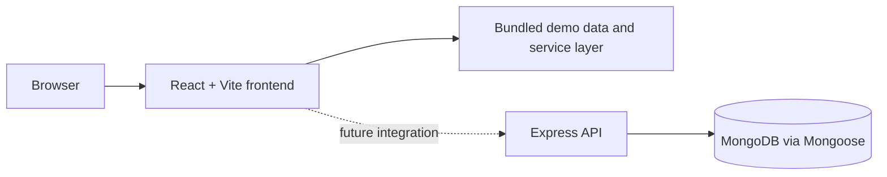

# Database Systems & Backend Development

This repository collects database-systems coursework and the **PharmaStock** medicine-inventory interface. It is organized into two areas:

- `Practicals/` — database-systems exercises and reports (Week 1–9).
- `Project/` — the PharmaStock frontend prototype, its design documentation, a review presentation, and the separate Week 9 Student Management implementation.

## PharmaStock — current status

PharmaStock is a pharmaceutical inventory management interface covering medicines, batches, suppliers, purchases, sales, expiry monitoring, low-stock views, analytics, reports, users, and settings.

**Current scope: a React + Vite frontend prototype backed entirely by local demo data.**

The frontend service layer simulates network latency and returns bundled fixtures so that the entire PharmaStock UI can be evaluated without a running server. There is **no PharmaStock backend, database, or API integration yet**. All authentication, inventory mutations, and analytics resolve against local mock data and React state; a page refresh reverts mutations.

The PharmaStock backend (Express + Mongoose + MongoDB) is designed and documented as the next milestone but has **not been implemented**. See [Project/docs/ABSTRACT.md](Project/docs/ABSTRACT.md) for the target architecture.

## What exists today

| Layer | Status |
| --- | --- |
| React + Vite dashboard frontend | Implemented (17 pages, 38 components) |
| Demo data layer (medicines, batches, suppliers, transactions, users) | Implemented (in-memory fixtures) |
| Design system (CSS design tokens, responsive, reduced-motion) | Implemented |
| PharmaStock Express/Mongoose backend | **Not implemented — planned** |
| PharmaStock MongoDB persistence | **Not implemented — planned** |
| Week 9 Student Records backend | Implemented and verified |
| Week 9 MongoDB persistence | Implemented and verified |
| JWT authentication | **Not implemented — decorative demo login only** |
| PharmaStock API integration | **Not implemented — service layer returns local fixtures** |

## Week 9 Student Management practical

Week 9 is implemented separately at [`Project/Week-9-Student-Management/`](Project/Week-9-Student-Management/). It follows the supplied Student Management and Student Records CRUD sources: a React/Vite form and table uses Axios to call an Express REST API, which uses Mongoose with MongoDB. The verified endpoints are `POST /students`, `GET /students`, `GET /students/:id`, `PATCH /students/:id`, and `DELETE /students/:id`.

Run the backend from `Project/Week-9-Student-Management/backend` with `npm install`, a local `MONGO_URI` in `.env`, and `npm run dev`; run the frontend from `Project/Week-9-Student-Management/frontend` with `npm install` and `npm run dev`. The self-contained practical report is [`Practicals/Week-9/KARKALA_SHIVA_REDDY_2520030105_Week_9_DB_DS_Practical.docx`](Practicals/Week-9/KARKALA_SHIVA_REDDY_2520030105_Week_9_DB_DS_Practical.docx).

## Architecture (target, not yet implemented)



## Technology stack

| Area | Technologies |
| --- | --- |
| Frontend | React 18, Vite, React Router, Recharts, Lucide React, CSS |
| Backend (PharmaStock planned) | Node.js, Express, Mongoose, MongoDB, JWT, bcrypt |
| Week 9 practical | Node.js, Express, Mongoose, MongoDB, React, Vite, Axios |
| Documentation | Markdown, database schema notes, coursework reports |

## Run the frontend demo

```bash
cd Project/frontend
npm install
npm run dev
```

Open the Vite URL printed in the terminal. Routes include `/login`, `/dashboard`, `/medicines`, `/batches`, `/low-stock`, `/expiry`, `/suppliers`, `/purchases`, `/sales`, `/analytics`, `/reports`, `/users`, `/profile`, and `/settings`.

Login uses a design-time demo account (shown on the login screen). It is a client-side comparison, **not** real authentication — the PharmaStock backend is not present yet.

## Project structure

```text
Practicals/             database exercises and reports
Project/
  frontend/             React/Vite dashboard and local demo data
  Week-9-Student-Management/
                         Week 9 React, Express, Mongoose and MongoDB practical
  docs/                 abstract, review presentation, design notes
```

## Verification

```bash
cd Project/frontend
npm run build
```

There is no automated test suite or CI workflow yet. The next PharmaStock integration step is to build its Express/Mongoose backend, wire the frontend service layer to real API routes, add request validation and API tests, and define transaction boundaries for stock changes.

*Screenshots captured from live frontend demo (Vite dev server, all data from local demo fixtures — no backend connected) on 2026-09-17.*

## Author

**Karkala Shiva Reddy** — [GitHub](https://github.com/karkalashivareddy)
